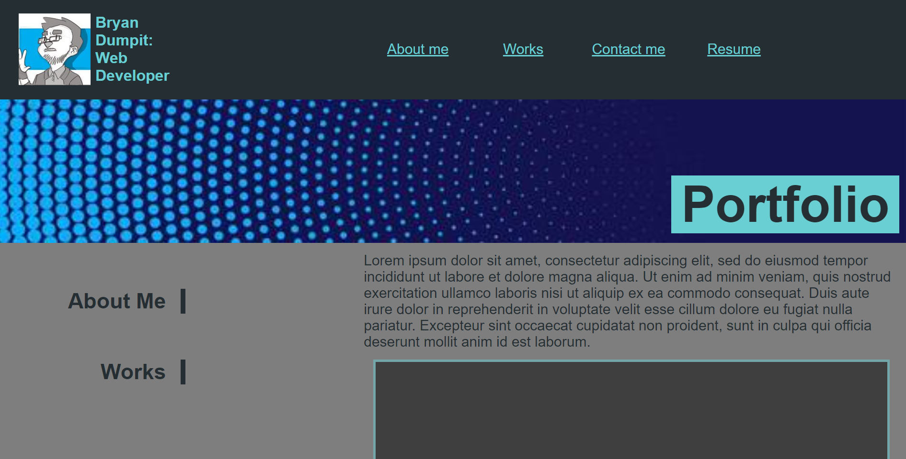

# Bryan Dumpit Web Development Portfolio

## Purpose

A website that provides information about me, my projects and how to contact me.

## Built With

* HTML
* CSS

## Website

* https://bryandumpit.github.io/BDPortfolio/

## Contribution

Made with ❤️ by Bryan Dumpit

## Project Details
* index.html (home page) was created to layout the content as required by the acceptance criteria and the mock-up of the project.
* style.CSS was used to style all elements of the portfolio with specifc focus on use of flex box, pseudoclasses and css variables.
* The CSS rules defined in style.css used relative values (%, vw, etc.). This allowed the page to reorganize in a readable fashion even when the screen size and orientation is changed to match different media screen sizes. Media queries were not used.
* The project cards in the work section and the resume link to a placeholder page since the projects have not been performed. Run-Buddy is live, so the project card links to the actual page. 
